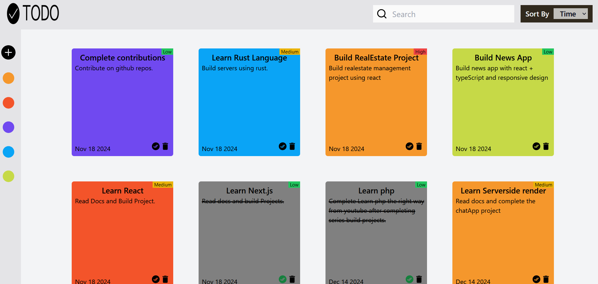

# Task Manager Application

## 1. Application and Functionality

The Task Manager Application is a React-based tool designed to help users manage their tasks effectively. The app allows users to:

- **Add tasks** with a title, description, priority level, and automatically generated date.
- **Mark tasks as completed** or toggle their completion status.
- **Delete tasks** when no longer needed.
- **Prioritize tasks** using color-coded labels:
  - Low: 🟢 Green
  - Medium: 🟡 Yellow
  - High: 🔴 Red.

The app is built with a **responsive design** and styled using **Tailwind CSS**, ensuring accessibility and usability across devices.

---

## 2. Setup and Launch Process

### Prerequisites

- **Node.js** installed on your system.
- A package manager like **npm** or **yarn**.

### Setup Steps

#### Clone the Repository

```bash
git clone https://github.com/Devz-0047/Todo
cd task-manager
```

#### Install Dependencies

```bash
npm install
```

#### Run the Development Server

```bash
npm run dev
```

## 3. Assumptions Made During Development

### Default Priority Levels

- Tasks are assigned one of three priority levels: **Low**, **Medium**, or **High**.

### Date Formatting

- The `date-fns` library is used to format the task creation date as `MMM dd yyyy`.

### Unique IDs

- Tasks are assigned unique IDs using `crypto.randomUUID()`, assuming browser support for this method.

### Single User Scope

- This version assumes a single-user application without authentication or multi-user functionality.

### Persistent State

- Currently, state is maintained in memory and will reset upon reload. Local storage or backend support is not included.

## 4. Screenshots

### Task Manager interfaces

#### Full Screen



#### Medium Screen


#### Small Screen


#### Mobile Phone Screen


